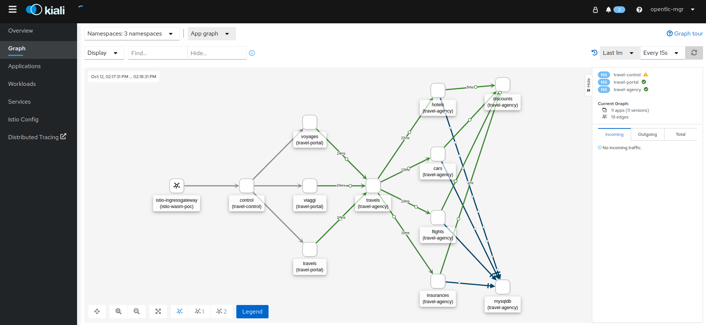

= Splitting Istio Configs Visibility Per Namespace
:toc:

* `ServiceMesh` Version: 2.0
* Purpose: Configs will not be distributed to _Envoy istio-proxy_ sidecar beyond the same namespace unless overriden by configurations of _SideCar_ CR resource

== Setup ServiceMesh installation

* Pre-Requisites

`ServiceMesh` Operators Installation *TBD*

* Setup

1. Control Plane Namespace Creation

	oc new-project <istio-system-tenant-2>

2. SMCP

	oc apply -f smcp-2.0.yaml
	
  ** or modify/apply the following
  
	apiVersion: maistra.io/v2
	kind: ServiceMeshControlPlane
	metadata:
	  name: <tenant-2>
	  namespace: <istio-system-tenant-2>
	spec:
	  tracing:
	    sampling: 10000
	    type: Jaeger
	  general:
	    logging:
	      logAsJSON: true
	  profiles:
	    - default
	  proxy:
	    accessLogging:
	      file:
		name: /dev/stdout
	  policy:
	    type: Istiod
	  addons:
	    grafana:
	      enabled: true
	    jaeger:
	      install:
		storage:
		  type: Memory
	    kiali:
	      enabled: true
	    prometheus:
	      enabled: true
	  version: v2.0
	  telemetry:
	    type: Istiod

  ** Reset

	oc delete -f smcp-2.0.yaml

3. SMBR

	oc apply -f smmr.yaml

  ** Reset	

	oc delete -f smmr.yaml

== Setup Mesh Deployments

1. httpbin namespace & httpbin deployment

link:../Scenario-0-Deploy-In-ServiceMesh/README.adoc#httpbin[Deploy httpbin]

2. travel-agency, travel-control, travel-portal namespace & deployments

link:../Scenario-0-Deploy-In-ServiceMesh/README.adoc#travel-agency[Deploy travel agency]

3. *TBD* echo-grpc ??

4. *TBD* hello client/service

== Testing

1. Get configurations of `istio-proxy` sidecar before applying any xref:anchor-1[`Sidecar`] CR override resources

  ** Retrieve `istio-proxy` (envoy) `cluster`, `endpoint`, `route` configurations from multiple PODs in the namespaces (ex. below) and compare. They contain cross namespace configurations
  
  	istioctl proxy-config cluster control-5fcd7bb48d-zgnwf
  	istioctl proxy-config route control-5fcd7bb48d-zgnwf
  	istioctl proxy-config route control-5fcd7bb48d-zgnwf
  	 
   *** Full configuration can be extracted	 
   	
	oc rsh -Tc istio-proxy control-5fcd7bb48d-zgnwf curl http://localhost:15000/config_dump >> <POD-NAME>-config-original.txt	
	

2. Get configurations of `istio-proxy` sidecar after applying xref:anchor-1[`Sidecar`]  CR in `ServiceMesh` control plane namespace for the whole mesh

  	istioctl proxy-config cluster control-5fcd7bb48d-zgnwf
  	istioctl proxy-config route control-5fcd7bb48d-zgnwf
  	istioctl proxy-config route control-5fcd7bb48d-zgnwf
  	 
   ** Full configuration can be extracted	 
   	
	oc rsh -Tc istio-proxy control-5fcd7bb48d-zgnwf curl http://localhost:15000/config_dump >> <POD-NAME>-config-original.txt
	
3. Get configurations of `istio-proxy` sidecar for PODs in `travel-control`, `travel-portal`, `travel-agency`, `httpbin` namespaces after applying xref:anchor-2[`Sidecar`]  override CRs. The 3 first should have configs for each other but not for `httpbin` and vice-versa.
	
  	istioctl proxy-config cluster control-5fcd7bb48d-zgnwf
  	istioctl proxy-config route control-5fcd7bb48d-zgnwf
  	istioctl proxy-config route control-5fcd7bb48d-zgnwf

  	
   ** Send Requests on httpbin

   	watch -n 5 curl -i -X GET "http://httpbin2-httpbin-gateway-525eca1d5089dbdc-istio-wasm-poc.apps.cluster-6tzwm.6tzwm.sandbox256.opentlc.com//response-headers?freeform=" -H "accept: application/json"

   ** Send Requests on travel-control (not required)
   
   	watch -n 5 curl -i -X GET "http://istio-ingressgateway-istio-wasm-poc.apps.cluster-6tzwm.6tzwm.sandbox256.opentlc.com/"  

image::graphs/travel-app-external-graph.png[400,400]

== Apply `Sidecar` for configuration distribution & visibility restrictions in the mesh

[[anchor-1]]
* Apply `ServiceMesh` wide CR `Sidecar` to force configuration distribution and `mesh` visibility within namespace and control plane namespace only

	#use as is or change istio control plane namespace details
	oc apply -f sidecar-all-mesh.yaml 

[[anchor-2]]
* Apply `Sidecar` CR override to `travel-control`, `travel-portal`, `travel-agency` namespace _istio configuration_ 

	#use as is or change istio control plane namespace details
	oc apply -f sidecar-override-travel-namespaces.yaml -n travel-control
	oc apply -f sidecar-override-travel-namespaces.yaml -n travel-portal
	oc apply -f sidecar-override-travel-namespaces.yaml -n travel-agency

