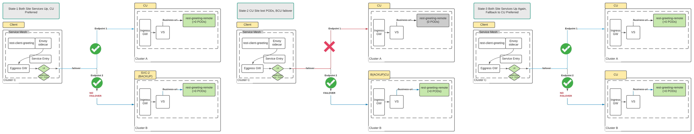
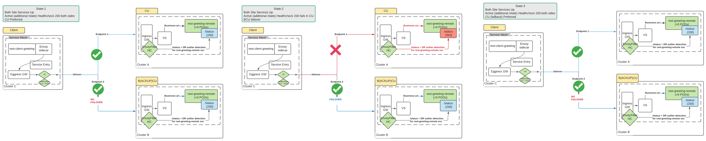
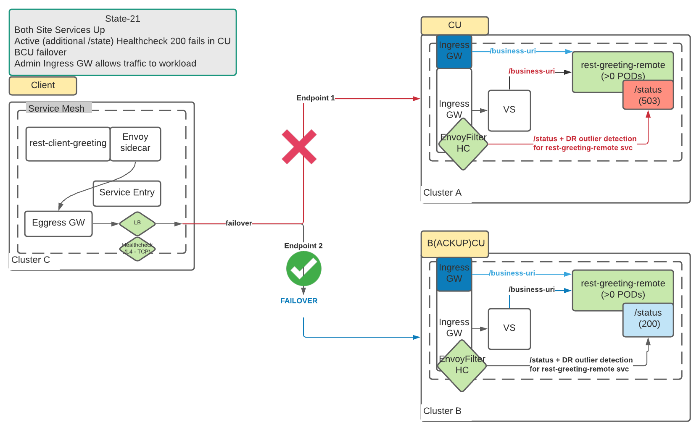

= Sending Traffic Cross-Cluster to Other (non-Federated cluster) Service Mesh Services 
:toc:

* `ServiceMesh` Version: 2.0
* Purpose: Client will send traffic to External Services

== Setup ServiceMesh installation

* Pre-Requisites

1. Setup of 3 OCP Clusters (1 client, 2 service clusters)

2. `ServiceMesh` Operators Installation in the 3 clusters

	scripts/add-operators-subscriptions-sm-2.1.sh (*Elastic Search Works only from console due to openshift-operators-redhat namespace creation need*)

* Setup

1. Control Plane Namespace Creation (apply on client & service clusters)

	oc new-project <istio-system-tenant-x>

2. SMCP & SMMR (apply the following *on client & service clusters* for cross-cluster topology testing)

	./create-smcp-smmr.sh <istio-system-tenant-6> <tenant digit x> <istio-smmr-namespace>
	eg. [CLIENT ONLY] ./create-smcp-smmr.sh istio-system-tenant-6 6 greetings-client-6
	eg. [SERVICE ONLY] ./create-smcp-smmr.sh istio-system-tenant-6 6 greetings-service-6
	
  ** or modify/apply the following SMCP
  
	apiVersion: maistra.io/v2
	kind: ServiceMeshControlPlane
	metadata:
	  name: <tenant-x>
	  namespace: <istio-system-tenant-x>
	spec:
	  addons:
	    grafana:
	      enabled: true
	    jaeger:
	      install:
		storage:
		  type: Memory
	    kiali:
	      enabled: true
	    prometheus:
	      enabled: true
	  general:
	    logging:
	      logAsJSON: true
	  policy:
	    type: Istiod
	  profiles:
	    - default
	  proxy:
	    accessLogging:
	      file:
		name: /dev/stdout
	    networking:
	      trafficControl:
		outbound:
		  policy: REGISTRY_ONLY
	  telemetry:
	    type: Istiod
	  tracing:
	    sampling: 10000
	    type: Jaeger
	  version: v2.0  
	  
  ** or modify/apply the following SMMR
  
	apiVersion: maistra.io/v1
	kind: ServiceMeshMemberRoll
	metadata:
	  name: default
	spec:
	  members:
	    - ${SM_MR_NS}"  
	    
  ** Reset

	oc delete smcp <tenant-x> -n <istio-system-tenant-x>
	oc delete -f smmr-greetings-client.yaml -n <istio-system-tenant-x> (on Client Cluster)
	oc delete -f smmr-greetings-service.yaml -n <istio-system-tenant-x> (on Service Clusters)
		
	
== Setup Service Mesh Deployments
	
*Important*: Deploy _Greeting Client_ and _Greeting Service_ on separate OCP Clusters/Meshes if topology to be cross-cluster

=== Service Mesh greetings-client-service scripted deployments
	
*Note 1:* The Scripts can be found in link:./create-greeting-client.sh[create-greeting-client.sh] and link:./create-greeting-remote-service.sh[create-greeting-remote-service.sh]

*Note 2:* We use below scripted deployments of 2 services _*Greeting Client*_ link:../coded-services/quarkus-rest-client-greeting[quarkus-rest-client-greeting] and _Greeting Service_ link:../coded-services/quarkus-rest-greeting-remote[quarkus-rest-greeting-remote] in the Service Mesh (more on the services at link:../Scenario-0-Deploy-In-ServiceMesh/README.adoc#greetings-client-service[greetings client/service])
	
* Create Deployments & Service Mesh Configs	

  ** In *Service Clusters* (_must match SMCP/SMMR namespace details from above_) add `rest-greeting-remote` service in the mesh
  *** *Service Cluster 1*
	
	./create-greeting-remote-service.sh <SMCP Namspace> <SMMR namespace> <SMCP Ingress Gateway URL> <REMOTE Service Route HostName> <Greeting Cluster Specific Message>
	eg. ./create-greeting-remote-service.sh istio-system-tenant-6 greetings-service-6 istio-ingressgateway-istio-system-tenant-6.apps.cluster-ac6a.ac6a.sandbox1173.opentlc.com greeting.remote.com OCP-48-Cluster		

  *** *Service Cluster 2*

	./create-greeting-remote-service.sh <SMCP Namspace> <SMMR namespace> <SMCP Ingress Gateway URL> <REMOTE Service Route HostName> <Greeting Cluster Specific Message>
	eg. ./create-greeting-remote-service.sh istio-system-tenant-6 greetings-service-6 istio-ingressgateway-istio-system-tenant-6.apps.rosa-e532.qxhy.p1.openshiftapps.com greeting.remote.com Rosa-Remote-Cluster
	
  ** In *Client Clusters* (_must match SMCP/SMMR namespace details from above_) add `rest-client-greeting` service in the mesh
	
	./create-greeting-client.sh <SMCP Namspace> <SMMR namespace> <SMCP Ingress Gateway URL> <Remote 1 - SMCP Ingress Gateway URL>  <Remote 2 - SMCP Ingress Gateway URL> <REMOTE Service Route HostName>
	eg. ./create-greeting-client.sh istio-system-tenant-6 greetings-client-6 istio-ingressgateway-istio-system-tenant-6.apps.cluster-vnm7p.vnm7p.sandbox1792.opentlc.com istio-ingressgateway-istio-system-tenant-6.apps.cluster-ac6a.ac6a.sandbox1173.opentlc.com istio-ingressgateway-istio-system-tenant-6.apps.rosa-e532.qxhy.p1.openshiftapps.com greeting.remote.com

* How is local/external service location of `rest-greeting-remote` service is defined for `rest-client-greeting`

.Remote Service Location Setting on `rest-client-greeting`  deployment
====
[cols="2*^",options="header"]
|===
|How To Use
|Set Value

|*Default*
|oc set env dc/rest-client-greeting GREETINGS_SVC_LOCATION=http://rest-greeting-remote.greetings-service.svc.cluster.local:8080 

|oc rollout latest dc/rest-greeting-remote
|oc set env dc/rest-client-greeting GREETINGS_SVC_LOCATION='http://hello.remote.com'

|===
====

== Testing `rest-client-greeting` in Service Mesh

The following tests simulate the states depicted in the images

  ** Calling directly one of the *Service Cluster* deployments
  
	curl -X GET http://$(oc get route hello-remote -o jsonpath='{.spec.host}' -n <istio-system-control-plane-namespace>)/hello/Stelios        

  ** Calling the *Client Cluster* deployment
	
	curl -X GET http://$(oc get route istio-ingressgateway -o jsonpath='{.spec.host}' -n <istio-system-control-plane-namespace>)/say/goodday-to/Stelios  
	
  **  Continuous execution and changes in availability of service in the clusters
  
  	watch -n 2 curl -i http://$(oc get route istio-ingressgateway -o jsonpath='{.spec.host}' -n <istio-system-control-plane-namespace>)/say/goodday-to/Stelios	
  	oc scale --replicas=0 dc rest-greeting-remote -n greetings-service-6
  	oc scale --replicas=1 dc rest-greeting-remote -n greetings-service-6

== Reset Deployments & Service Mesh	

  ** Client Cluster
  
	oc delete project greetings-client	
	
  ** Service Cluster

	oc delete project greetings-service	
	
  ** Service Cluster

	oc delete project  <istio-system-control-plane-namespace>	

== Sub-Scenario 4a: Setup Service Mesh Additional Active Healthcheck

*Aim:* Incorporate a uri from within the targeted workload which re-directs requests from all workloads (in this case `rest-greeting-remote`) to a workload which determines the overall namespace/service side health state to be  in Service Mesh as a healthcheck which determines upstream cluster health and access

The following setup/tests simulate the states depicted in the images

 

1. Add Service Mesh Healthcheck and Outlier Detection on default Service Mesh `istio-ingressgateway` workload on both *Service Cluster* sides

	sub-scenarios/fault-detection-via-EnvoyFilter/additional-sm-hc-and-outlier-detection-on-greeting-remote-from-gw.sh <SERVICE_NAME> <SERVICE_NAMESPACE> <SERVICE_HEALTHCHECK_URI> <GW_APP_NAME> <GW_NAMESPACE>
	eg. sub-scenarios/fault-detection-via-EnvoyFilter/additional-sm-hc-and-outlier-detection-on-greeting-remote-from-gw.sh rest-greeting-remote greetings-service-1 /status/check istio-ingressgateway

2. Set additional URI `status` to `200 SUCCESS` on both *Service Cluster* sides

	sub-scenarios/fault-detection-via-EnvoyFilter/additional-sm-hc-uri-set-200-success.sh <SERVICE_POD> <SERVICE_NAME> <SERVICE_NAMESPACE>
	eg. sub-scenarios/fault-detection-via-EnvoyFilter/additional-sm-hc-uri-set-200-success.sh rest-greeting-remote-2-hfd5l rest-greeting-remote greetings-service-1
	
3. Check *Service Cluster* sides for behavior

  ** watch client
  
  3. Check *Service Cluster* sides for behavior

	watch -n 2 curl -X GET http://istio-ingressgateway-istio-system-tenant-1.apps.cluster-mfkjv.mfkjv.sandbox1680.opentlc.com/say/goodday-to/Stelios                                                    
	...
	Greetings (OCP-Cluster-47) Stelios. And have a good day!
  
  ** KIALI (client, service cluster 1, service cluster 2)
  ** GW Logs (service cluster 1, service cluster 2)
  ** Service Envoy Proxy Access Logs (service cluster 1, service cluster 2)
  
4. Set additional URI `status` to `503 FAIL` on 1 of the 2 *Service Cluster* sides

	sub-scenarios/fault-detection-via-EnvoyFilter/additional-sm-hc-uri-set-503-fail.sh <SERVICE_POD> <SERVICE_NAME> <SERVICE_NAMESPACE>
	eg. sub-scenarios/fault-detection-via-EnvoyFilter/additional-sm-hc-uri-set-503-fail.sh rest-greeting-remote-2-hfd5l rest-greeting-remote greetings-service-1

5. Check *Service Cluster* sides for behavior

  ** watch client (once HC has been executed)
  
	watch -n 2 curl -X GET http://istio-ingressgateway-istio-system-tenant-1.apps.cluster-mfkjv.mfkjv.sandbox1680.opentlc.com/say/goodday-to/Stelios                                                    
	...
	Greetings (OCP-Cluster-4.8) Stelios. And have a good day
  
  ** KIALI (client, service cluster 1, service cluster 2)
  ** GW Logs (service cluster 1, service cluster 2)
  ** Service Envoy Proxy Access Logs (service cluster 1, service cluster 2)

6. Re-Set additional URI `status` to `200 SUCCESS` on the failing *Service Cluster* side

	sub-scenarios/fault-detection-via-EnvoyFilter/additional-sm-hc-uri-set-200-success.sh <SERVICE_POD> <SERVICE_NAME> <SERVICE_NAMESPACE>
	eg. sub-scenarios/fault-detection-via-EnvoyFilter/additional-sm-hc-uri-set-200-success.sh rest-greeting-remote-2-hfd5l rest-greeting-remote greetings-service-1
	
7. Check *Service Cluster* sides for behavior

WARNING: Recheck `EnvoyFilter` and `DestinationRules` configuration as it takes a few minutes to be rectified

  ** watch client (traffic once SM via HealthCheck & DestinationRule rectified goes back to primary *Service Cluster* side). 
  
	watch -n 2 curl -X GET http://istio-ingressgateway-istio-system-tenant-1.apps.cluster-mfkjv.mfkjv.sandbox1680.opentlc.com/say/goodday-to/Stelios                                                    
	...
	Greetings (OCP-Cluster-47) Stelios. And have a good day!	

== Sub-Scenario 4b: Setup Service Mesh Additional Gateway

*Aim:* Following *Sub-Scenario 4a* there is the need to access the workload `rest-greeting-remote` even when the `status` URI shows failures (eg. admin actions on the workloads). The scenario is depicted in the images

The following setup/tests simulate the state depicted in the image

 

1. Add Additional Ingress Gateway with new metadata to `SMCP` (apply the following *on service clusters* only)

  ** Effective changes to SMCP
  
  gateways:
    additionalIngress:
      admin-ingress:
        enabled: true
        runtime:
          deployment:
            autoScaling:
              enabled: false
        service:
          metadata:
            labels:
              app: admin-ingressgateway
          selector:
            app: admin-ingressgateway
            
  **  Update SMCP & SMMR with additional ingress gateway (apply the following *on service clusters* only)

	./create-smcp-smmr-sc-4b.sh <istio-system-tenant-6> <tenant digit x> <istio-smmr-namespace>
	eg. [SERVICE ONLY] ./create-smcp-smmr.sh-sc-4b.sh istio-system-tenant-1 1 greetings-service-1             
            
2. Add Service Mesh Configs `Gateway` and `VirtualService` to allow traffic to the `rest-greeting-remote` workload via the new `admin-ingressgateway`
      
      sub-scenarios/4b-multiple-gateways-different-health-behavior/additional-smcp-gw-vs-to-bypass-hc.sh <GW_APP_NAME> <GW_NAMESPACE> <SERVICE_NAMESPACE>
      eg. sub-scenarios/4b-multiple-gateways-different-health-behavior/additional-smcp-gw-vs-to-bypass-hc.sh admin-ingressgateway istio-system-tenant-1 greetings-service-1          

3. Test behavior on different routes

  ** DEFAULT ROUTE (on failing by healthcheck cluster it should be failing: 
  
    	curl -iv -X GET http://$(oc get route istio-ingressgateway -o jsonpath='{.spec.host}' -n istio-system-tenant-1)/say/hello/Nick
    	no healthy upstream

  ** ADMIN ROUTE (should get a response: 
  
  	curl -iv -X GET http://$(oc get route admin-ingressgateway -o jsonpath='{.spec.host}' -n istio-system-tenant-1)/say/hello/Nick
	Greetings (OCP-Cluster-47) Nick

  

4. change EnvoyFilter below to use as workload selector app=istio-ingressgateway
spec:
  workloadSelector:
    labels:
      app: istio-ingressgateway

5. After that although failures in EnvoyFilter stop remote client to access cluster 4.7 usint the admin Gateway

$ curl -X GET http://admin-ingressgateway-istio-system-tenant-1.apps.cluster-t7v5g.t7v5g.sandbox1318.opentlc.com/hello/greeting/Nick
Greetings (OCP-Cluster-47) Nick

$ curl -X GET http://istio-ingressgateway-istio-system-tenant-1.apps.cluster-t7v5g.t7v5g.sandbox1318.opentlc.com/hello/greeting/Nick
no healthy upstream

  	
	
