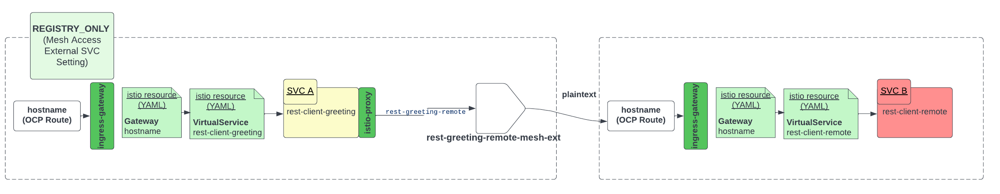
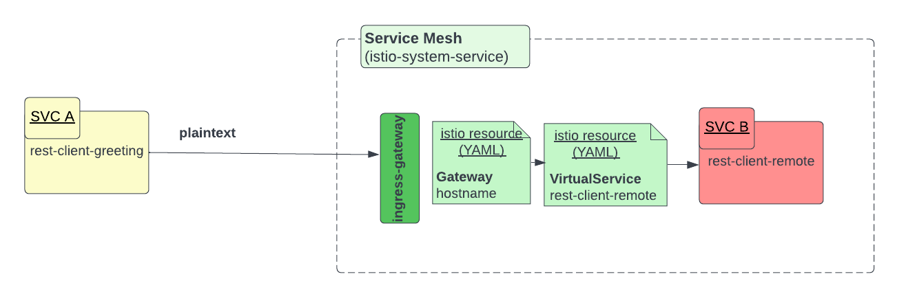

= Testing OSSM Edge Configurations
:toc:

The following showcase how behavior is affected by Mesh `spec.proxy.networking.trafficControl.policy` settings of `ALLOW_ANY` and `REGISTRY_ONLY` and also how you can enable incoming requests to the mesh from a non-mesh but same OCP cluster namespace

== Demo `Outgoing` Mesh Access with REGISTRY_ONLY & mTLS

* Follow instructions in link:https://github.com/skoussou/servicemesh-playground/tree/main/Scenario-MTLS-3-SM-Service-To-External-MTLS-Handling#option-1a-directly-via-sidecar[Option 1a: directly (via Sidecar)]
* After the above works successfully. `oc delete ServiceEntry rest-greeting-remote-mesh-ext -n  greetings-client` will result in a failure as without `ServiceEntry` the mesh will not allow external traffic when  policy: REGISTRY_ONLY

== Demo `Outgoing` Mesh Access with ALLOW_ANY (non-mTLS)

[NOTE]
====
First execute the above as it is required also for this demo)
====

* With the above demo working as expected execute link:https://github.com/skoussou/servicemesh-playground/blob/main/Scenario-MTLS-3-SM-Service-To-External-MTLS-Handling/test-greeting-client-allow-any.sh[`test-greeting-client-allow-any.sh`] to setup access to external service without `ServiceEntry` due to `ALLOW_ANY` mesh setting of `spec.proxy.networking.trafficControl.policy` 

----
Istio setting to configure the sidecar handling of external services, that is, those services that are not defined in Istio’s internal service registry. (see: https://istio.io/latest/docs/tasks/traffic-management/egress/egress-control/#envoy-passthrough-to-external-services-

ALLOW_ANY, the Istio proxy lets calls to unknown services pass through

echo "apiVersion: maistra.io/v2
kind: ServiceMeshControlPlane
metadata:
  name: tenant-allow-any
spec:
...
  proxy:
..
    networking:
      trafficControl:
        inbound: {}
        outbound:
          policy: ALLOW_ANY 
----          

image::./images/spec.proxy.networking.trafficControl.policy.allow_any.png[400,1000]  

* Change to `REGISTRY_ONLY`  (failures will start to occur on the client side)

	watch curl -i  http://$(oc get route istio-ingressgateway -o jsonpath='{.spec.host}' -n istio-system-client-allow-any)/say/goodday-to/Stelios

image::./images/spec.proxy.networking.trafficControl.policy.registry_only.png[400,1000]  

* Apply the `ServiceEntry`  (failures will start to occur on the client side)

----
echo "apiVersion: networking.istio.io/v1beta1
kind: ServiceEntry
metadata:
  name: rest-greeting-remote-mesh-ext
  namespace: greetings-client-allow-any  
spec:
  hosts:
    - istio-ingressgateway.istio-system-service.svc.cluster.local
  location: MESH_EXTERNAL
  ports:
    - name: http
      number: 80
      protocol: HTTP2
  resolution: DNS" |oc apply -f -
----

  

== Demo `Incoming` Mesh Access (non-mTLS)

[NOTE]
====
First execute the above as it is required also for this demo)
====

* With the above demo working as expected execute link:https://github.com/skoussou/servicemesh-playground/blob/main/Scenario-MTLS-3-SM-Service-To-External-MTLS-Handling/test-greeting-client-non-mesh.sh[`test-greeting-client-non-mesh.sh`] to setup access from an external (to the mesh) service but in the same cluster 

]  

