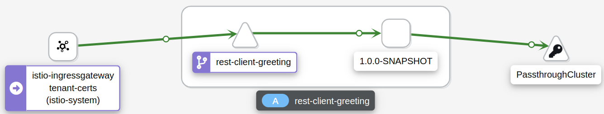
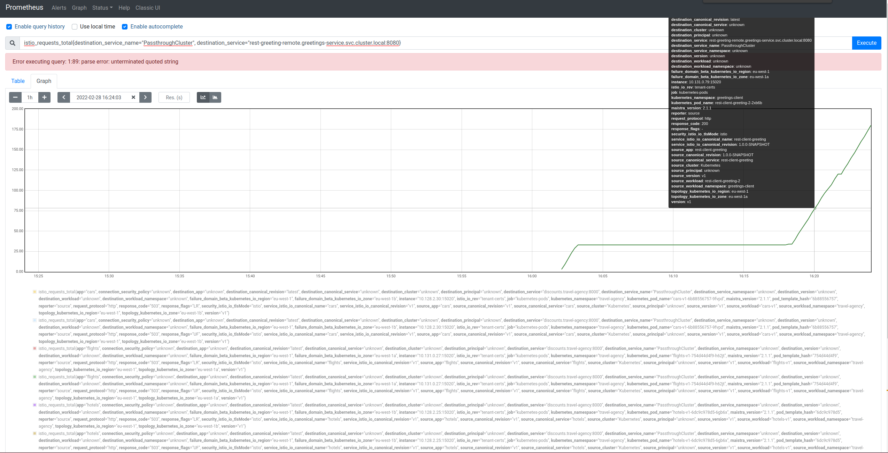
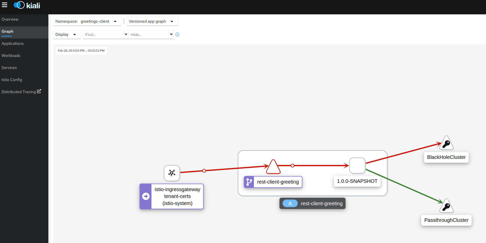
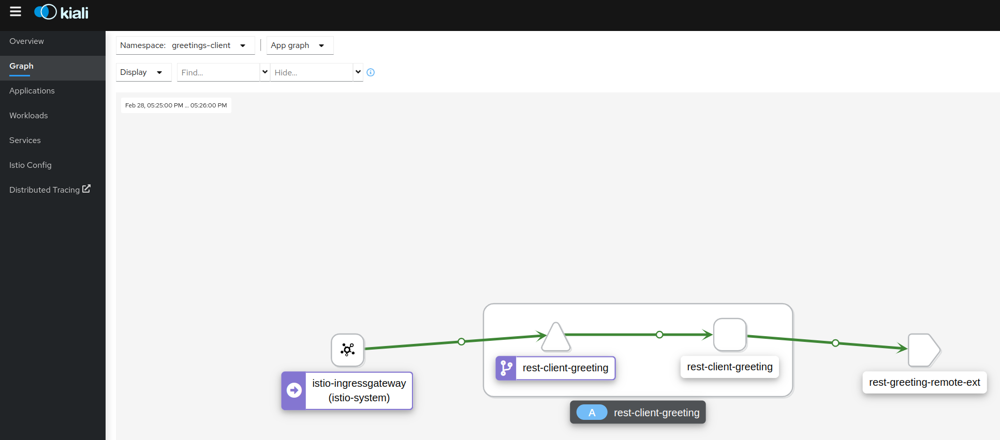
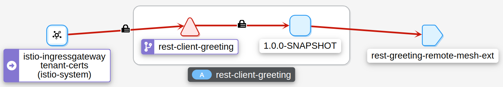
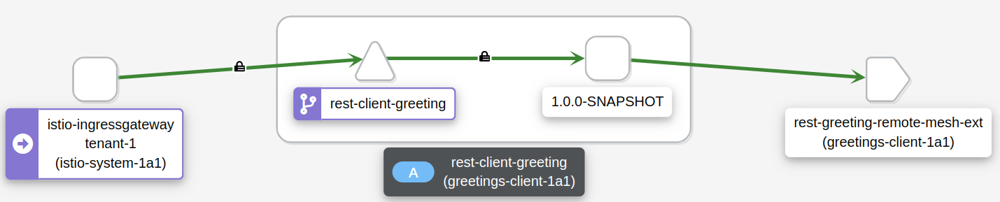

= Securing traffic to external Services with mTLS
:toc:

== Option 1: Secure Traffic to another external service (could be another ServiceMesh not managed by Service Mesh Federation)

=== Option 1a: directly (via `Sidecar`)

==== encrypted

[NOTE]
====
In this scenario a `ServiceEntry` for the remote service hostname will be required and for _TLS origination from istio-proxy (envoy)_ a `DestinationRule` to `ServiceEntry` host with:

a) `CA Certificate` for verification of the external service server side certificate (other SM ingress gateway if external service is in a non Federation managed SM)
b) `Client certificate/key pair` if the external service (other SM ingress gateway if external service is in a non Federation managed SM) requires client authentication (mTLS). Cert/key pair must be signed by the client CA configured on the external service (other SM ingress gateway if external service is in a non Federation managed SM)

====

. *Step 1:* Setup a *_Service Side_* Service Mesh (command below) and add link:https://github.com/skoussou/servicemesh-playground/tree/main/Scenario-0-Deploy-In-ServiceMesh#greetings-client-service[Greetings Service] (namespace: `greetings-service`) in the mesh and EXPOSE the service via custom `ROUTE` with TLS certificate as follows:
+
----
oc new-project istio-system-service <1>
oc apply -f smcp-2.1.1-registry_only-strict-mtls.yaml -n istio-system-service  (change SMCP name in smcp-2.1.1-registry_only-strict-mtls.yaml to service-side-tenant) <2>
cd ../scripts/certs 
# Create secret for this host <3>
oc create -n istio-system-service secret generic hello-remote-secret --from-file=tls.key=hello-remote-app.key --from-file=tls.crt=hello-remote-app.crt --from-file=ca.crt=ca-root.crt
echo ` ./create-greeting-service-1a.sh <SMCP Namspace> <SMCP NAME> <APP namespace> <REMOTE Service Route HostName> <Route Certificate Name>  <Greeting Cluster Specific Message> `
./create-greeting-service-1a.sh istio-system-service service-side-tenant greetings-service hr-stio-sstm-svc.apps.cluster-10e2.10e2.sandbox1371.opentlc.com hello-remote-secret OCP-48-Cluster <5>
----
<1> Create *_service side_* Service Mesh Control Plane namespace 
<2> Create a service mesh control plane for the service application
<3> Create Certs (with same CA as client) for `rest-greeting-remote` service using public DNS hostname like `hr-stio-sstm-svc.apps.cluster-10e2.10e2.sandbox1371.opentlc.com` (see: link:https://github.com/skoussou/servicemesh-playground/blob/main/scripts/certs/README.adoc#create-a-ca-root-certificate-signing-request-tls-certificate-for-hosted-service[Create a CA Root, Certificate Signing Request, TLS Certificate for hosted service])
<4> Create Secret with Certs in the _Service Mesh Control Plane Namespace_ (see: link:https://github.com/skoussou/servicemesh-playground/blob/main/scripts/certs/README.adoc#create-ocp-secret-to-store-the-certificate-in-istio-system[Create OCP secret to store the certificate] ]
<5> Create app namespace, deploy `rest-greeting-remote` app, create Service Mesh Traffic Configurations (`Gateway`, `VirtualService` and `Route` resources) to make the application accessible via Service Mesh and over TLS
+
* *Test:* `SIMPLE` TLS (`Gateway` resource must be set to `tls.mode: SIMPLE`)
+
----
curl -k -X GET https://$(oc get route hello-remote -o jsonpath='{.spec.host}' -n istio-system-service)/hello/greeting/Stelios (if route not DNS resolvable--resolve '$(oc get route hello-remote -o jsonpath='{.spec.host}' -n istio-system-service):443:<IP OF istio-ingressgateway ROUTE eg.54.171.162.158>')
watch curl -k -X GET https://$(oc get route hello-remote -o jsonpath='{.spec.host}' -n istio-system-service)/hello/greeting/Stelios
watch curl --cacert ca-root.crt  -X GET https://$(oc get route hello-remote -o jsonpath='{.spec.host}' -n istio-system-service)/hello/greeting/Stelios
Greetings (OCP-48-Cluster) Stelios
----
+
* *Test:* `MUTUAL` TLS (`Gateway` resource must be set to `tls.mode: MUTUAL` and client created with the same CA see: link:https://github.com/skoussou/servicemesh-playground/tree/main/scripts/certs#create-client-certificate[Create Client TLS Certificate for hosted service])
+
----
watch curl -s --cacert ca-root.crt --key curl-client.key --cert curl-client.crt -X GET https://$(oc get route hello-remote -o jsonpath='{.spec.host}' -n istio-system-service)/hello/greeting/Stelios
Greetings (OCP-48-Cluster) Stelios
----
+
. *Step 2:* Setup a *_Client Side_* Service Mesh (command below) and add  link:https://github.com/skoussou/servicemesh-playground/tree/main/Scenario-0-Deploy-In-ServiceMesh#greetings-client-service[Greetings Client Service] (namespace: `greetings-client`) within the mesh (configure app to access remote URL of `Greetings Service`)
+
----
oc new-project istio-system-client <1>
oc apply -f smcp-2.1.1-registry_only-strict-mtls.yaml -n istio-system-client  (change SMCP name in smcp-2.1.1-registry_only-strict-mtls.yaml to client-side-tenant) <2>
cd ../scripts/certs 
# Create Client secrets <3>
oc create -n greetings-client secret generic greeting-client-secret --from-file=greeting-client-app.key --from-file=greeting-client-app.crt --from-file=ca-root.crt <4>
echo ` ./create-greeting-service-1a.sh <SMCP Namspace> <SMCP Name> <APP namespace> <SMR Resource Name> <REMOTE Service Route HostName> <REMOTE Service Mesh istio-ingressgateway route URL (no DNS for route hostname> <Route Certificate Name> `
./create-greeting-client-1a.sh istio-system-client client-side-tenant greetings-client greeting.remote.com istio-ingressgateway-istio-system-service.apps.cluster-10e2.10e2.sandbox1371.opentlc.com greeting-client-secret  <5>
----
<1> Create *_client side_* Service Mesh Control Plane namespace 
<2> Create a service mesh control plane for the client application
<3> Create Certs (with same CA as service) for `rest-client-greeting` service (see: link:https://github.com/skoussou/servicemesh-playground/tree/main/scripts/certs#create-client-certificate[Create Client TLS Certificate for hosted service])
<4> Create Secret with Certs in the _Application Namespace_  (as we use it via `DestinationRule` in the sidecar TLS origination and Not gateway) (see: link:https://github.com/skoussou/servicemesh-playground/tree/main/scripts/certs#create-ocp-secret-to-store-the-client-greeting-client-secret-certificate-in-istio-system[Create OCP secret to store the client certificate ]
<5> Create app namespace, deploy `rest-client-greeting` app, create ISTIO Configurations to be accessible and access remotely `rest-greeting-remote` <5>
+

[NOTE]
====
Mixup Problems that can occur in the configuration are listed at and in the above we are following the config to avoid Double TLS)
* link:https://istio.io/latest/docs/ops/configuration/traffic-management/tls-configuration/#outbound[Outbound]
* link:https://istio.io/latest/docs/ops/common-problems/network-issues/#double-tls[Double TLS (TLS origination for a TLS request)]
====

* *WILL NOT IMPLEMENT* ServiceEntry and If TLS origination from application:

Application configuration with:
CA Certificate for external service server side certificate (other SM ingress gateway if external service is in a non Federation managed SM)
Client certificate/key pair if the external service (other SM ingress gateway if external service is in a non Federation managed SM) requires client authentication (mTLS). Cert/key pair must be signed by the client CA configured on the external service (other SM ingress gateway if external service is in a non Federation managed SM)

==== un-encrypted

===== Variation 1: In a Service Mesh with security `PERMISSIVE`

Connect to External Service with `ServiceEntry` resource definition

* *Step 1:* Setup a Service Mesh (command below) and add  link:https://github.com/skoussou/servicemesh-playground/tree/main/Scenario-0-Deploy-In-ServiceMesh#greetings-client-service[Greetings Client Service] (namespace: `greetings-client`) within the mesh whilst leaving `Greetings Service` outside (namespace: `greetings-service`)

	oc apply -f smcp-2.1.1-allow_any-auto-mtls.yaml -n <ISTIO_NAMESPACE>

** `ServiceMeshControlPlane` setup
*** `proxy.networking.trafficControl.outbound.policy: ALLOW_ANY`
*** mesh security for mtls is permissive (`spec.security.dataPlane.automtls: true` or `spec.security.dataPlane.mtls: false`)
** `ServiceMeshMemberRoll` include `greetings-client` namespace
** Test it 

	watch curl -X GET http://$(oc get route istio-ingressgateway -o jsonpath='{.spec.host}' -n istio-system)/say/goodday-to/Stelios` 

** And watch from the KIALI UI the requests flowing from rest-greeting-client to _external service_ established via `PassthroughCluster` 
+
  

** Metrics show the service `rest-greeting-remote.greetings-service.svc.cluster.local:8080` that requests reach when going via `PassThroughCluster` (`istio_requests_total{destination_service_name="PassthroughCluster", destination_service="rest-greeting-remote.greetings-service.svc.cluster.local:8080}`)
+
  

* *Step 2:* Change `ServiceMeshControlPlane` setup to block external services access with `REGISTRY_ONLY` 
** `proxy.networking.trafficControl.outbound.policy: REGISTRY_ONLY`
**  mesh security for mtls is permissive (`spec.security.dataPlane.automtls: true` or `spec.security.dataPlane.mtls: false`)

	oc apply -f smcp-2.1.1-registry_only-auto-mtls.yaml -n <ISTIO_NAMESPACE>
    
** The result is requests to start being directed to `BlackHoleCluster`
+

** Create `ServiceEntry` to register external details
      
	echo "kind: ServiceEntry
	apiVersion: networking.istio.io/v1alpha3
	metadata:
	  name: rest-greeting-remote-mesh-ext
	spec:
	  hosts: 
	    - rest-greeting-remote.greetings-service.svc.cluster.local
	  ports:
	    - name: http-8080
	      number: 8080
	      protocol: HTTP
	      targetPort: 8080
	  location: MESH_EXTERNAL
	  resolution: DNS" |oc apply -n greetings-client -f -  

** The requests will now start going through to external `rest-greeting-remote-mesh-ext`
+
   

===== Variation 2: In a Service Mesh with security `STRICT`

In a Service Mesh where mTLS security is `STRICT` between workloads, connect to External Service with `ServiceEntry` definition and `DestinationRule` to EXCLUDE `details` from the rule

	oc apply -f smcp-2.1.1-registry_only-strict-mtls.yaml -n <ISTIO_NAMESPACE>

* `ServiceMeshControlPlane` setup
** `proxy.networking.trafficControl.outbound.policy: REGISTRY_ONLY`
** mesh security for mtls is strict (`spec.security.dataPlane.mtls: true`)
* `ServiceMeshMemberRoll` include `greetings-client` namespace
* Test it and watch from the KIALI UI the requests flowing from rest-greeting-client to _external service_ established via `PassthroughCluster` 

	watch curl -X GET http://$(oc get route istio-ingressgateway -o jsonpath='{.spec.host}' -n istio-system)/say/goodday-to/Stelios` 

* The result is requests  to external `rest-greeting-remote-mesh-ext` are starting to fail
+

        
* Create `DestinationRule` to `DISABLE` mTLS for the external service communication
      
	echo "apiVersion: "networking.istio.io/v1alpha3"
	kind: "DestinationRule"
	metadata:
	  name: "disable-mtls-rest-greeting-remote-ext"
	  namespace: "greetings-client"
	spec:
	  host: rest-greeting-remote.greetings-service.svc.cluster.local
	  trafficPolicy:
	    tls:
	      mode: DISABLE" |oc apply -n greetings-client -f - 

* The requests will now start again to flow through to external `rest-greeting-remote-mesh-ext`
+        

=== Option 1b: via Egress Gateway

echo "################# Gateway - istio-egressgateway [$SM_CP_NS] #################"    
echo "kind: Gateway
apiVersion: networking.istio.io/v1alpha3
metadata:
  name: istio-egressgateway
spec:
  servers:
    - hosts:
        - '*'
      port:
        name: http
        number: 80
        protocol: HTTP
  selector:
    istio: egressgateway" | oc apply -n $SM_CP_NS -f -    

echo "################# VirtualService - gateway-routing [$SM_CP_NS] #################"    
echo "kind: VirtualService
apiVersion: networking.istio.io/v1alpha3
metadata:
  name: gateway-routing
spec:
  hosts:
    - ${REMOTE_SERVICE_ROUTE}
  gateways:
    - mesh
    - istio-egressgateway
  http:
    - match:
        - gateways:
            - mesh
          port: 80
      route:
        - destination:
            host: istio-egressgateway.${SM_CP_NS}.svc.cluster.local
    - match:
        - gateways:
            - istio-egressgateway
          port: 80
      route:
        - destination:
            host: ${REMOTE_SERVICE_ROUTE}
            subset: target-subset
          weight: 100
  exportTo:
    - '*'  " | oc apply -n $SM_CP_NS -f -   

==== encrypted

* Better alternative is using link:https://docs.openshift.com/container-platform/4.9/service_mesh/v2x/ossm-federation.html[Service Mesh Federation]

* Else ServiceEntry, Gateway, VirtualService, DestinationRule to Egress Gateway 
** If TLS origination from Egress Gateway :

DestinationRule to ServiceEntry hosts with:
CA Certificate for external service server side certificate (other SM ingress gateway if external service is in a non Federation managed SM)
Client certificate/key pair if the external service (other SM ingress gateway if external service is in a non Federation managed SM) requires client authentication (mTLS). Cert/key pair must be signed by the client CA configured on the external service (other SM ingress gateway if external service is in a non Federation managed SM)
 
** If TLS origination from application:

Application configuration with:
CA Certificate for external service server side certificate (other SM ingress gateway if external service is in a non Federation managed SM)
Client certificate/key pair if the external service (other SM ingress gateway if external service is in a non Federation managed SM) requires client authentication (mTLS). Cert/key pair must be signed by the client CA configured on the external service (other SM ingress gateway if external service is in a non Federation managed SM)
 
==== unencrypted

* ServiceEntry, Gateway, VirtualService, DestinationRule to Egress Gateway

== Option 2: To an external service on another Federation managed Service Mesh

=== Option 2a: directly
- encrypted

[TBD SHOWN VIA FEDERATION IMPL]
====
(Federation uses a pair of Ingress/Egress gateways dedicated to access to imported services)
====

* unencrypted

WARNING: Unencrypted traffic is not possible by design. 

=== Option 2b: via Egress Gateway

- encrypted

[TBD SHOWN VIA FEDERATION IMPL]
====
`ServiceMeshPeer`, `ExportedServiceSets`, `ImportedServiceSets`
Use encrypted TCP for intermesh traffic between Ingress/Gateways pairs.
====

- unencrypted

WARNING: Unencrypted traffic is not possible by design.

[[anchor-1]]
=== ARCHIVE

2. point to details in the bookinfo-not-mesh service

echo "kind: VirtualService
apiVersion: networking.istio.io/v1alpha3
metadata:
  name: details-custom
  namespace: bookinfo
spec:
  hosts:
    - details
  gateways:
    - mesh
  http:
    - route:
        - destination:
            host: details.bookinfo-no-mesh.svc.cluster.local
            subset: nomesh
            port:
              number: 9080
            weight: 100" |oc apply -f -
              

echo "kind: DestinationRule
apiVersion: networking.istio.io/v1alpha3
metadata:
  name: details-nomesh-control
  namespace: bookinfo
spec:
  host: details
  subsets:
    - labels:
        version: nomesh
      name: nomesh" |oc apply -f -
      
      
echo "kind: ServiceEntry
apiVersion: networking.istio.io/v1alpha3
metadata:
  name: external-details
spec:
  hosts: 
    - details.bookinfo-no-mesh.svc.cluster.local
  ports:
    - name: http
      number: 9080
      protocol: HTTP2
      targetPort: 9080
  location: MESH_EXTERNAL
  resolution: DNS
  exportTo:
    - istio-system-certs
    - bookinfo" |oc apply -f -      
    
    
echo "kind: VirtualService
apiVersion: networking.istio.io/v1alpha3
metadata:
  name: discounts-custom
  namespace: travel-agency
spec:
  hosts:
    - discounts
  gateways:
    - mesh
  http:
    - route:
        - destination:
            host: discounts.travel-no-mesh.svc.cluster.local
            port:
              number: 8000
            weight: 100" |oc apply -f -
            
echo "kind: ServiceEntry
apiVersion: networking.istio.io/v1alpha3
metadata:
  name: external-discounts
  namespace: travel-agency  
spec:
  hosts: 
    - discounts.bookinfo-no-mesh.svc.cluster.local
  ports:
    - name: http
      number: 8000
      protocol: HTTP2
      targetPort: 8000
  location: MESH_EXTERNAL
  resolution: DNS
  exportTo:
    - istio-system
    - travel-agency" |oc apply -f -              
            
            
            
            

echo "kind: DestinationRule
apiVersion: networking.istio.io/v1alpha3
metadata:
  name: discounts-custom
  namespace: travel-agency
spec:
  hosts: discounts.travel-agency.svc.cluster.local
  subsets:
  - name: discount-external" |oc apply -f - 
----
echo "kind: VirtualService
apiVersion: networking.istio.io/v1alpha3
metadata:
  name: discounts-custom
  namespace: travel-agency
spec:
  hosts:
    - discounts.travel-agency.svc.cluster.local
  gateways:
    - mesh
  http:
    - match:
        - uri:
            prefix: /discounts
      name: external-discounts
      route:
        - destination:
            host: discounts.travel-no-mesh.svc.cluster.local
            port:
              number: 8000" |oc apply -f - 
----
kind: ServiceEntry
apiVersion: networking.istio.io/v1alpha3
metadata:
  name: external-discounts
  namespace: travel-agency
spec:
  hosts:
    - discounts.travel-no-mesh.svc.cluster.local
  addresses: ~
  ports:
    - name: http
      number: 8000
      protocol: HTTP
      targetPort: 8000
  location: MESH_EXTERNAL
  resolution: DNS
  endpoints: ~
  workloadSelector: ~
  exportTo:
    - travel-agency
  subjectAltNames: ~ 
  
  
  
  
  
  
  
  
  
Solutions for 1a - Sidecar MUTUAL TLS

kubectl -n client create secret generic cluster-a-client --from-file=cluster-a-client-cert.pem --from-file=cluster-a-client-key.pem --from-file=root-cert.pem

sidecar.istio.io/userVolumeMount: '[{"name":"cluster-a-client", "mountPath":"/etc/certs/myclientcert.pem", "readonly":true}]'
sidecar.istio.io/userVolume: '[{"name":"cluster-a-client", "secret":{"secretName":"cluster-a-client"}}]'

        tls:
          mode: MUTUAL
          clientCertificate: /etc/cluster-a-client/cluster-a-client-cert.pem
          privateKey: /etc/cluster-a-client/cluster-a-client-key.pem
          caCertificates: /etc/cluster-a-client/root-cert.pem

clientCertificate: /etc/certs/myclientcert.pem
      privateKey: /etc/certs/client_private_key.pem
      caCertificates: /etc/certs/rootcacerts.pem
      
kubectl create secret generic my-cert --from-file=cert1.crt --from-file=cert2.crt
annotations:                                                                                       
  sidecar.istio.io/userVolumeMount: '[{"name":"my-cert", "mountPath":"/etc/my-cert", "readonly":true}]'
  sidecar.istio.io/userVolume: '[{"name":"my-cert", "secret":{"secretName":"my-cert"}}]'

oc create -n greetings-client secret generic greeting-client-secret --from-file=greeting-client-app.key --from-file=greeting-client-app.crt --from-file=ca-root.crt
annotations:                                                                                       
  sidecar.istio.io/userVolumeMount: '[{"name":"greeting-client-secret", "mountPath":"/etc/certs", "readonly":true}]'
  sidecar.istio.io/userVolume: '[{"name":"greeting-client-secret", "secret":{"secretName":"greeting-client-secret"}}]'      
      
        tls:
          mode: MUTUAL
          clientCertificate: /etc/certs/greeting-client-app.crt
          privateKey: /etc/certs/greeting-client-app.key
          caCertificates: /etc/certs/ca-root.crt       

oc create -n greetings-client secret generic greeting-client-secret --from-file=key=greeting-client-app.key --from-file=cert=greeting-client-app.crt --from-file=cacert=ca-root.crt <4>
oc create -n istio-system-service secret generic greeting-client-secret --from-file=tls.key=greeting-client-app.key --from-file=tls.crt=greeting-client-app.crt --from-file=ca.crt=ca-root.crt -n istio-system-service <4>  
  
  
  
============= WORKING TO POINT TO SE BUT 503 because I had PORT 80 t etc. etc. =============
kind: VirtualService
apiVersion: networking.istio.io/v1alpha3
metadata:
  name: rest-client-greeting
  namespace: greetings-client
spec:
  hosts:
    - '*'
  gateways:
    - rest-client-gateway
  http:
    - match:
        - uri:
            prefix: /say
      route:
        - destination:
            host: rest-client-greeting
            port:
              number: 8080

kind: DestinationRule
apiVersion: networking.istio.io/v1alpha3
metadata:
  name: originate-tls-to-rest-greeting-remote
  namespace: greetings-clientkind: ServiceEntry
apiVersion: networking.istio.io/v1alpha3
metadata:
  name: rest-greeting-remote-mesh-ext
  namespace: greetings-client
spec:
  hosts:
    - greeting.remote.com
  addresses: ~
  ports:
    - name: http
      number: 80
      protocol: HTTP
  location: MESH_EXTERNAL
  resolution: DNS
  endpoints:
    - address: 54.171.162.158
      ports:
        http: 80
  workloadSelector: ~
  exportTo:
    - '*'
  subjectAltNames: ~
spec:
  host: greeting.remote.com
  trafficPolicy:
    tls:
      mode: SIMPLE
  exportTo:
    - '*'
============= CHANGES 1 (Not trying to connect but trying to see if there is ANY point using hostAliases in rest-client-greeting since ServiceEntry should allow this to be resolved??? =============

remove hostAliases completely

RESULT: IT DOES NOT LOOK TO HAVE ANY EFFECT IF REMOVED STILL GOING TO SE

============= CHANGES 2 - Since greeting.remote.com is failing to be sent accross I will modify the SE resource =============
kind: ServiceEntry
apiVersion: networking.istio.io/v1alpha3
metadata:
  name: rest-greeting-remote-mesh-ext
  namespace: greetings-client
spec:
  hosts:
    - greeting.remote.com
  addresses: ~
  ports:
    - name: http
      number: 80
      protocol: HTTP
  location: MESH_EXTERNAL
  resolution: DNS
  endpoints:
    - address: 54.171.162.158
      ports:
        http: 80
  exportTo:
    - '*'

RESULT: HTTP/1.1 503 Service Unavailable

a) 

kind: ServiceEntry
apiVersion: networking.istio.io/v1alpha3
metadata:
  name: rest-greeting-remote-mesh-ext
  namespace: greetings-client
spec:
  hosts:
    - greeting.remote.com
  ports:
    - name: http
      number: 443
      protocol: HTTP
  location: MESH_EXTERNAL
  resolution: DNS
  endpoints:
    - address: hr-stio-sstm-svc.apps.cluster-10e2.10e2.sandbox1371.opentlc.com
      ports:
        http: 443
  exportTo:
    - '*'

RESULT: < HTTP/1.1 503 Service Unavailabl

B)
spec:
  hosts:
    - greeting.remote.com
  addresses: ~
  ports:
    - name: https
      number: 443
      protocol: HTTP2
  location: MESH_EXTERNAL
  resolution: DNS
  endpoints:
    - address: hr-stio-sstm-svc.apps.cluster-10e2.10e2.sandbox1371.opentlc.com
      ports:
        https: 443
  workloadSelector: ~
  exportTo:
    - '*'
  subjectAltNames: ~

C)
spec:
  hosts:
    - greeting.remote.com
  addresses: ~
  ports:
    - name: https
      number: 443
      protocol: HTTP2
  location: MESH_EXTERNAL
  resolution: STATIC
  endpoints:
    - address: 54.171.162.158
      ports:
        https: 443
  workloadSelector: ~
  exportTo:
    - '*'
  subjectAltNames: ~

E)

spec:
  hosts:
    - hr-stio-sstm-svc.apps.cluster-10e2.10e2.sandbox1371.opentlc.com
  addresses: ~
  ports:
    - name: https
      number: 443
      protocol: HTTP2
  location: MESH_EXTERNAL
  resolution: STATIC
  endpoints:
    - address: 54.171.162.158
  workloadSelector: ~
  exportTo:
    - '*'
  subjectAltNames: ~

kind: DestinationRule
apiVersion: networking.istio.io/v1alpha3
metadata:
  name: originate-tls-to-rest-greeting-remote
  namespace: greetings-client
spec:
  host: hr-stio-sstm-svc.apps.cluster-10e2.10e2.sandbox1371.opentlc.com
  trafficPolicy:
    tls:
      credentialName: greeting-client-secret
      mode: MUTUAL
      sni: hr-stio-sstm-svc.apps.cluster-10e2.10e2.sandbox1371.opentlc.com
  exportTo:
    - '*'

F)

echo "apiVersion: networking.istio.io/v1alpha3
kind: VirtualService
metadata:
  name: rewrite-port-for-rest-greeting-remote
  namespace: greetings-client  
spec:
  hosts:
  - hr-stio-sstm-svc.apps.cluster-10e2.10e2.sandbox1371.opentlc.com
  http:
  - match:
    - port: 80
    route:
    - destination:
        host: hr-stio-sstm-svc.apps.cluster-10e2.10e2.sandbox1371.opentlc.com
        port:
          number: 443
  exportTo:
    - '*'"|oc apply -f -
    
echo "kind: DestinationRule
apiVersion: networking.istio.io/v1alpha3
metadata:
  name: originate-tls-to-rest-greeting-remote
  namespace: greetings-client
spec:
  host: hr-stio-sstm-svc.apps.cluster-10e2.10e2.sandbox1371.opentlc.com
  trafficPolicy:
    tls:
      credentialName: greeting-client-secret
      mode: MUTUAL
  exportTo:
    - '*'"|oc apply -f -
          
          
          
          

========================================================================
echo "kind: ServiceEntry
apiVersion: networking.istio.io/v1alpha3
metadata:
  name: rest-greeting-remote-mesh-ext
  namespace: greetings-client
spec:
  hosts:
    - greeting.remote.com
  addresses: ~
  ports:
    - name: https
      number: 443
      protocol: HTTP2
  location: MESH_EXTERNAL
  resolution: STATIC
  endpoints:
    - address: >-
        istio-ingressgateway-istio-system-service.apps.cluster-10e2.10e2.sandbox1371.opentlc.com
      ports:
        http: 80
      weight: 100
  exportTo:
    - istio-system" |oc apply -f -
    
    
    
echo "kind: ServiceEntry
apiVersion: networking.istio.io/v1alpha3
metadata:
  name: rest-greeting-remote-mesh-ext
  namespace: greetings-client
spec:
  hosts:
    - greeting.remote.com
  addresses: ~
  ports:
    - name: https
      number: 443
      protocol: HTTP2
  location: MESH_EXTERNAL
  resolution: DNS
  endpoints:
    - address: 108.128.79.33
  exportTo:
    - istio-system" |oc apply -f -    
    
echo "kind: ServiceEntry
apiVersion: networking.istio.io/v1alpha3
metadata:
  name: rest-greeting-remote-mesh-ext
  namespace: greetings-client
spec:
  hosts:
    - greeting.remote.com
  ports:
    - name: https
      number: 443
      protocol: HTTP2
  location: MESH_EXTERNAL
  resolution: DNS
  endpoints:
    - address: 52.19.250.50
      ports:
        https: 443    
  exportTo:
    - '*'" |oc apply -f -     

      
echo "kind: DestinationRule
apiVersion: networking.istio.io/v1alpha3
metadata:
  name: originate-tls-to-rest-greeting-remote
  namespace: greetings-client
spec:
  host: greeting.remote.com
  trafficPolicy:
    tls:
      mode: SIMPLE
  exportTo:
    - '*'"|oc apply -f -    

      
      
      
curl -X GET http://$(oc get route istio-ingressgateway -o jsonpath='{.spec.host}' -n istio-system-client)/say/goodday-to/Stelios      
      
-----1 SETUP-------------------------
kind: DestinationRule
apiVersion: networking.istio.io/v1alpha3
metadata:
  name: originate-tls-to-rest-greeting-remote
  namespace: greetings-client
spec:
  host: greeting.remote.com
  trafficPolicy:
    tls:
      mode: SIMPLE
------------------------------------
kind: ServiceEntry
apiVersion: networking.istio.io/v1alpha3
metadata:
  name: rest-greeting-remote-mesh-ext
  namespace: greetings-client
spec:
  hosts:
    - greeting.remote.com
  addresses: ~
  ports:
    - name: https
      number: 443
      protocol: HTTP2
  location: MESH_EXTERNAL
  resolution: DNS
  endpoints:
    - address: 108.128.79.33
      ports:
        https: 443
  workloadSelector: ~
  exportTo:
    - '*'
  subjectAltNames: ~      
----------------------------------------  
curl http://localhost:8080/say/goodday-to/Stelios
022-03-03 17:04:04,621 ERROR [org.jbo.res.res.i18n] (executor-thread-1) RESTEASY002010: Failed to execute: org.jboss.resteasy.client.exception.ResteasyWebApplicationException: Unknown error, status code 502
	at org.jboss.resteasy.client.exception.WebApplicationExceptionWrapper.wrap(WebApplicationExceptionWrapper.java:107)
	at org.jboss.resteasy.microprofile.client.DefaultResponseExceptionMapper.toThrowable(DefaultResponseExceptionMapper.java:21)
	at org.jboss.resteasy.microprofile.client.ExceptionMapping$HandlerException.mapException(ExceptionMapping.java:39)
	at org.jboss.resteasy.microprofile.client.ProxyInvocationHandler.invoke(ProxyInvocationHandler.java:154)
	at com.sun.proxy.$Proxy28.getGreeting(Unknown Source)
	at org.acme.rest.client.GreetingsResource.goodday(GreetingsResource.java:35)
	at java.base/jdk.internal.reflect.NativeMethodAccessorImpl.invoke0(Native Method)
	at java.base/jdk.internal.reflect.NativeMethodAccessorImpl.invoke(NativeMethodAccessorImpl.java:62)
	at java.base/jdk.internal.reflect.DelegatingMethodAccessorImpl.invoke(DelegatingMethodAccessorImpl.java:43)
	at java.base/java.lang.reflect.Method.invoke(Method.java:566)
	at org.jboss.resteasy.core.MethodInjectorImpl.invoke(MethodInjectorImpl.java:170)
	at org.jboss.resteasy.core.MethodInjectorImpl.invoke(MethodInjectorImpl.java:130)
	at org.jboss.resteasy.core.ResourceMethodInvoker.internalInvokeOnTarget(ResourceMethodInvoker.java:643)
	at org.jboss.resteasy.core.ResourceMethodInvoker.invokeOnTargetAfterFilter(ResourceMethodInvoker.java:507)
	at org.jboss.resteasy.core.ResourceMethodInvoker.lambda$invokeOnTarget$2(ResourceMethodInvoker.java:457)
	at org.jboss.resteasy.core.interception.jaxrs.PreMatchContainerRequestContext.filter(PreMatchContainerRequestContext.java:364)
	at org.jboss.resteasy.core.ResourceMethodInvoker.invokeOnTarget(ResourceMethodInvoker.java:459)
	at org.jboss.resteasy.core.ResourceMethodInvoker.invoke(ResourceMethodInvoker.java:419)
	at org.jboss.resteasy.core.ResourceMethodInvoker.invoke(ResourceMethodInvoker.java:393)
	at org.jboss.resteasy.core.ResourceMethodInvoker.invoke(ResourceMethodInvoker.java:68)
	at org.jboss.resteasy.core.SynchronousDispatcher.invoke(SynchronousDispatcher.java:492)
	at org.jboss.resteasy.core.SynchronousDispatcher.lambda$invoke$4(SynchronousDispatcher.java:261)
	at org.jboss.resteasy.core.SynchronousDispatcher.lambda$preprocess$0(SynchronousDispatcher.java:161)
	at org.jboss.resteasy.core.interception.jaxrs.PreMatchContainerRequestContext.filter(PreMatchContainerRequestContext.java:364)
	at org.jboss.resteasy.core.SynchronousDispatcher.preprocess(SynchronousDispatcher.java:164)
	at org.jboss.resteasy.core.SynchronousDispatcher.invoke(SynchronousDispatcher.java:247)
	at io.quarkus.resteasy.runtime.standalone.RequestDispatcher.service(RequestDispatcher.java:73)
	at io.quarkus.resteasy.runtime.standalone.VertxRequestHandler.dispatch(VertxRequestHandler.java:138)
	at io.quarkus.resteasy.runtime.standalone.VertxRequestHandler.access$000(VertxRequestHandler.java:41)
	at io.quarkus.resteasy.runtime.standalone.VertxRequestHandler$1.run(VertxRequestHandler.java:93)
	at org.jboss.threads.EnhancedQueueExecutor$Task.run(EnhancedQueueExecutor.java:2415)
	at org.jboss.threads.EnhancedQueueExecutor$ThreadBody.run(EnhancedQueueExecutor.java:1452)
	at org.jboss.threads.DelegatingRunnable.run(DelegatingRunnable.java:29)
	at org.jboss.threads.ThreadLocalResettingRunnable.run(ThreadLocalResettingRunnable.java:29)
	at java.base/java.lang.Thread.run(Thread.java:829)
	at org.jboss.threads.JBossThread.run(JBossThread.java:501)      
[2022-03-03T17:04:04.537Z] "GET /hello/greeting/Stelios HTTP/1.1" 502 - direct_response - "-" 0 0 0 - "-" "Apache-HttpClient/4.5.13 (Java/11.0.14)" "34a5a5cc-4455-982f-8849-a4958e57199d" "greeting.remote.com" "-" - - 10.1.2.3:80 10.128.2.52:44322 - block_all

-----2 SETUP-------------------------
curl -X GET http://$(oc get route istio-ingressgateway -o jsonpath='{.spec.host}' -n istio-system-client)/say/goodday-to/Stelios      

kind: DestinationRule
apiVersion: networking.istio.io/v1alpha3
metadata:
  name: originate-tls-to-rest-greeting-remote
  namespace: greetings-client
spec:
  host: greeting.remote.com
  trafficPolicy:
    tls:
      mode: SIMPLE
  exportTo:
    - '*'
------------------------------------    
kind: ServiceEntry
apiVersion: networking.istio.io/v1alpha3
metadata:
  name: rest-greeting-remote-mesh-ext
  namespace: greetings-client
spec:
  hosts:
    - greeting.remote.com
  addresses: ~
  ports:
    - name: http
      number: 80
      protocol: HTTP
  location: MESH_EXTERNAL
  resolution: DNS
  endpoints:
    - address: 54.171.162.158
      ports:
        http: 80
  workloadSelector: ~
  exportTo:
    - '*'
  subjectAltNames: ~
----------------------------------------------
Every 2.0s: curl -s -v -X GET http://istio-ingressgateway-istio-system-client.apps.cluster-10e2.10e2.sandbox1371.opentlc.com/say/goodday-to/Stelios                                                                                                                                  stkousso.fedora: Fri Mar  4 07:27:13 2022

*   Trying 108.128.79.33:80...
* Connected to istio-ingressgateway-istio-system-client.apps.cluster-10e2.10e2.sandbox1371.opentlc.com (108.128.79.33) port 80 (#0)
> GET /say/goodday-to/Stelios HTTP/1.1
> Host: istio-ingressgateway-istio-system-client.apps.cluster-10e2.10e2.sandbox1371.opentlc.com
> User-Agent: curl/7.71.1
> Accept: */*
>
* Mark bundle as not supporting multiuse
< HTTP/1.1 503 Service Unavailable
< content-length: 0
< allow:
< content-type: text/plain
< x-envoy-upstream-service-time: 257
< date: Fri, 04 Mar 2022 07:27:14 GMT
< server: istio-envoy
< set-cookie: aab3b27253ec0b170632ad4df0c1be30=376317fa5e1917ec40e5fcd0276f2be4; path=/; HttpOnly
<
* Connection #0 to host istio-ingressgateway-istio-system-client.apps.cluster-10e2.10e2.sandbox1371.opentlc.com left intact
----------------------------------------------
  
  
