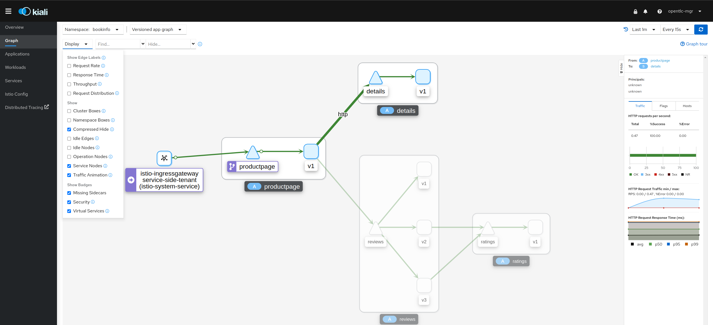
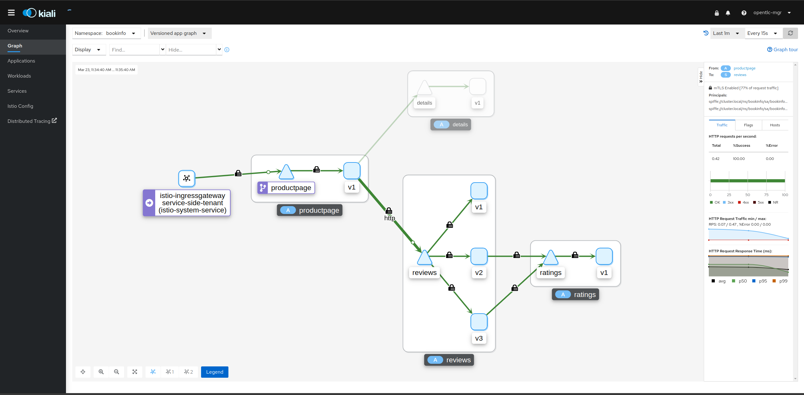

= Turning Off mTLS Authentication completely for a Service
:toc

== Setup Application

=== Prerequisites

* An OpenShift cluster
* The following Setups to have an active Service Mesh Control Plane without `mtls` security for the `dataPlane`

----
oc new-project istio-system <1>
./scripts/add-operators-subscriptions-sm-2.1.1.sh <2>
echo "apiVersion: maistra.io/v2
kind: ServiceMeshControlPlane
metadata:
  name: basic
  namespace: istio-system
  resourceVersion: '1540235'
  uid: 5aa39e74-bc89-4352-bc73-1acd281de448
spec:
  addons:
    grafana:
      enabled: true
    jaeger:
      install:
        storage:
          type: Memory
    kiali:
      enabled: true
    prometheus:
      enabled: true
  policy:
    type: Istiod
  profiles:
    - default
  telemetry:
    type: Istiod
  tracing:
    sampling: 10000
    type: Jaeger
  version: v2.1"| oc apply -n istio-system -f -
----

<1> Create *istio-system* namespace 
<2> Install operators for OSSM
<3> Create a service mesh control plane for the service application with `security.dataPlane.automtls: false` and `security.dataPlane.mtls: false`

* Setup the application link:https://github.com/skoussou/servicemesh-playground/tree/main/Scenario-0-Deploy-In-ServiceMesh#bookinfo[bookinfo]
* Add to each of the `Deployment` under `bookinfo` namespace the following annotation in order to register statistics by `istio-proxy` on TLS handshakes

	sidecar.istio.io/statsInclusionPrefixes: 'tls_inspector,listener,cluster'

=== Disable `mTLS` for all components with mTLS `PERMISSIVE`

* By default the `ServiceMeshControlPlane` sets `mtls` to `PERMISSIVE` mode

	oc get peerauthentication -n istio-system
	NAME                            MODE         AGE
	default                         PERMISSIVE   5d18h

* This means whilst you are hitting the URL 

	curl -s "http://$(oc get route istio-ingressgateway -o jsonpath='{.spec.host}' -n istio-system-certs)/productpage" | grep -o "<title>.*</title>"

* TLS handshakes take place and registered in the 

	oc rsh -c istio-proxy pod/productpage-v1-556db7cbb5-jks4c curl localhost:15000/stats |grep handshake	<-- HANDSHAKES TAKE PLACE
	oc rsh -c istio-proxy pod/details-v1-68cbd47bc5-gcq8l curl localhost:15000/stats |grep handshake	<-- HANDSHAKES TAKE PLACE
	oc rsh -c istio-proxy pod/details-v1-68cbd47bc5-gcq8l curl localhost:15000/stats |grep handshake	<-- HANDSHAKES TAKE PLACE
	oc rsh -c istio-proxy pod/reviews-v2-86c76b84c5-678gr curl localhost:15000/stats |grep handshake	<-- HANDSHAKES TAKE PLACE
	oc rsh -c istio-proxy pod/reviews-v3-56cbff6b99-xn6qz curl localhost:15000/stats |grep handshake	<-- HANDSHAKES TAKE PLACE

* Apply the following DRs

---- 
echo "apiVersion: networking.istio.io/v1beta1
kind: DestinationRule
metadata:
  name: productpage
spec:
  host: productpage.bookinfo.svc.cluster.local
  trafficPolicy:
    tls:
      mode: DISABLE" |oc apply -n bookinfo -f -

echo "apiVersion: networking.istio.io/v1beta1
kind: DestinationRule
metadata:
  name: productpage-2
spec:
  host: productpage
  trafficPolicy:
    tls:
      mode: DISABLE" |oc apply -n bookinfo -f -

echo "apiVersion: networking.istio.io/v1beta1
kind: DestinationRule
metadata:
  name: details
spec:
  host: details.bookinfo.svc.cluster.local
  trafficPolicy:
    tls:
      mode: DISABLE" |oc apply -n bookinfo -f -
      
echo "apiVersion: networking.istio.io/v1beta1
kind: DestinationRule
metadata:
  name: details-2
spec:
  host: details
  trafficPolicy:
    tls:
      mode: DISABLE" |oc apply -n bookinfo -f -      
	
echo "apiVersion: networking.istio.io/v1beta1
kind: DestinationRule
metadata:
  name: ratings
spec:
  host: ratings.bookinfo.svc.cluster.local
  trafficPolicy:
    tls:
      mode: DISABLE" |oc apply -n bookinfo -f -
      
echo "apiVersion: networking.istio.io/v1beta1
kind: DestinationRule
metadata:
  name: ratings-2
spec:
  host: ratings
  trafficPolicy:
    tls:
      mode: DISABLE" |oc apply -n bookinfo -f -      
      
echo "apiVersion: networking.istio.io/v1beta1
kind: DestinationRule
metadata:
  name: reviews
spec:
  host: reviews.bookinfo.svc.cluster.local
  trafficPolicy:
    tls:
      mode: DISABLE" |oc apply -n bookinfo -f -	      
      
echo "apiVersion: networking.istio.io/v1beta1
kind: DestinationRule
metadata:
  name: reviews-2
spec:
  host: reviews
  trafficPolicy:
    tls:
      mode: DISABLE" |oc apply -n bookinfo -f -	     
----
        
* Testing again the application we see no handshakes
** Checking the statistics captured now by `istio-proxy`     [[anchor-1]]    

----
oc rsh -c istio-proxy pod/productpage-v1-556db7cbb5-jks4c curl localhost:15000/stats |grep handshake	<-- NO HANDSHAKES TAKE PLACE
oc rsh -c istio-proxy pod/details-v1-68cbd47bc5-gcq8l curl localhost:15000/stats |grep handshake	<-- NO HANDSHAKES TAKE PLACE
oc rsh -c istio-proxy pod/details-v1-68cbd47bc5-gcq8l curl localhost:15000/stats |grep handshake	<-- NO HANDSHAKES TAKE PLACE
oc rsh -c istio-proxy pod/reviews-v2-86c76b84c5-678gr curl localhost:15000/stats |grep handshake	<-- NO HANDSHAKES TAKE PLACE
oc rsh -c istio-proxy pod/reviews-v3-56cbff6b99-xn6qz curl localhost:15000/stats |grep handshake	<-- NO HANDSHAKES TAKE PLACE
----

** KIALI shows a similar behavior (notice no "PADLOCK" on any of the connections and on the right handside *_unknknown Principals_* on the from/to:

   

=== Disable `mTLS` for all components with mTLS `STRICT`

* Modify the `ServiceMeshControlPlane` resource to force `mtls` to `STRICT` mode

----
  security:
    dataPlane:
      automtls: true
      mtls: true
      
oc get peerauthentication -n istio-system-service      
NAME                            MODE         AGE
default                         STRICT       5d18h
----

* Now any request to the productpage will fail

----
$ curl -v "http://$(oc get route istio-ingressgateway -o jsonpath='{.spec.host}' -n istio-system-service)/productpage" | grep -o "<title>.*</title>"
> Host: istio-ingressgateway-istio-system-service.apps.cluster-e8e9.e8e9.sandbox866.opentlc.com
> User-Agent: curl/7.71.1
> Accept: */*
> 
* Mark bundle as not supporting multiuse
< HTTP/1.1 503 Service Unavailable
< content-length: 95
< content-type: text/plain
< date: Wed, 23 Mar 2022 11:10:25 GMT
< server: istio-envoy
< set-cookie: 44371fc75fdb694d574e56e33b166cc7=619f273b9d2709119dd0b6b5b31cdc01; path=/; HttpOnly
----

* Set a `PeerAuthentication` resource to `DISABLE` mode for all deployments in `bookinfo`

----  
echo "apiVersion: security.istio.io/v1beta1
kind: PeerAuthentication
metadata:
  name: default-disable
  namespace: bookinfo
spec:
  mtls:
    mode: DISABLE" |oc apply -n bookinfo -f -
----
    
* The `PeerAuthentication` disables `mtls` for all services in this namespace and now communications are successful and without mTLS security (see xref:anchor-1[Checking the statistics & KIALI])

=== Enable `mTLS` for all components except `details`

* Apply the following to disable security ONLY for the `details` service

----
oc delete dr productpage -n bookinfo
oc delete dr productpage-2 -n bookinfo
oc delete dr reviews -n bookinfo
oc delete dr reviews-2 -n bookinfo
oc delete dr ratings -n bookinfo
oc delete dr ratings-2 -n bookinfo
oc delete peerauthentication default-disable -n bookinfo
echo "apiVersion: security.istio.io/v1beta1
kind: PeerAuthentication
metadata:
  name: details-mtls-disable
  namespace: bookinfo
spec:
  selector:
    matchLabels:
      app: details
  mtls:
    mode: DISABLE" |oc apply -n bookinfo -f -
----

* Testing should show the following in KIALI whilst you can also xref:anchor-1[check the `istio-proxy` handshake stats]

   

    
