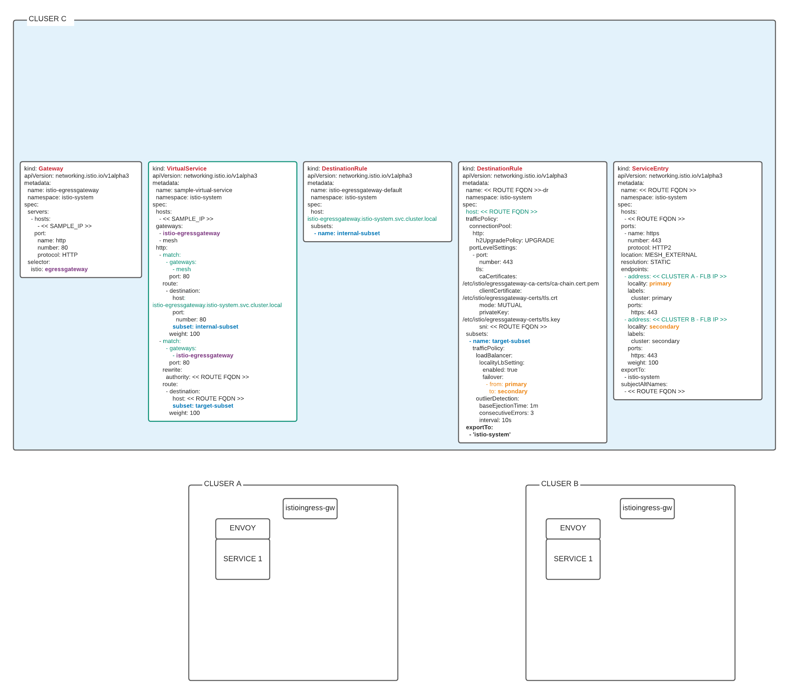

= Scenarios for Observability Setups
:toc:

== TRACING

=== (AS-IS STACK) Ways to Configure & Use

   
SM-TRACE-Arch-Options.png

=== (AS-IS STACK) How to Use

=== Enhance the Stack

== METRICS

=== (AS-IS STACK) Ways to Configure & Use Metrics

=== How/Where to add Application Metrics

. App Concern

. Architecture Concern
* Local Metrics
* OCP Monitoring Stack Metrics (Federation of SM & APP Metrics)
