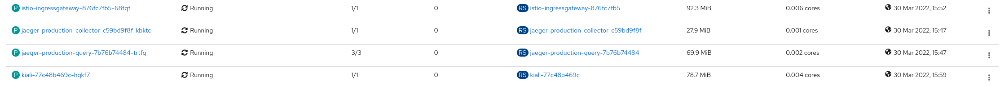

= Scenarios for Observability Setups
:toc:

Describes different Tracing and Metrics Setups for the Service Mesh

== TRACING

=== (Default STACK) - Non Production Setup

- setup
- sizing
- placement
- usage

=== (Default STACK) - Production Setup

[NOTE]
====
There can be more configurations than those presented.
====

* Resources
** link:https://docs.openshift.com/container-platform/4.8/service_mesh/v2x/ossm-reference-jaeger.html#jager-deployment-best-practices_jaeger-config-reference[Jaeger Deployment Best Practices]
** link:https://docs.openshift.com/container-platform/4.8/service_mesh/v2x/ossm-reference-jaeger.html#ossm-deploying-jaeger-production_jaeger-config-reference[Jaeger Production Setup]
** link:https://docs.openshift.com/container-platform/4.9/service_mesh/v2x/ossm-reference-jaeger.html#ossm-specifying-external-jaeger_jaeger-config-reference[Specifying Jaeger configuration in a Jaeger custom resource]
** link:https://github.com/jaegertracing/jaeger-client-java/blob/master/jaeger-core/README.md[Jaeger Core for Workload ENV Properties]

==== Setup A: DaemonSet Jaeger Agent

[NOTE]
====
- Jaeger agent as a `DaemonSet` is not supported for multitenant installations or OpenShift Dedicated. Jaeger agent as a sidecar is the only supported configuration for these use cases.
- *Warning:* There can only ever be a single `DaemonSet` in a cluster node therefore if Service Mesh multi-tenancy is required this cannot be the option selesected as only 1 DaemonSet will be available.
====

1. Setup
* Jaeger
** Consider and apply link:https://www.jaegertracing.io/docs/1.32/operator/#openshift[pre-requisites for Jaeger Agent as DaemonSet on Openshift]
** Jaeger Resource

	oc apply -f https://raw.githubusercontent.com/skoussou/servicemesh-playground/main/Scenario-Observability-Scenarios/jaeger-daemonset.yaml

* Service Mesh SMCP with external Jaeger Deployment

	oc apply -f https://raw.githubusercontent.com/skoussou/servicemesh-playground/main/Scenario-Observability-Scenarios/smcp-2.1.1-external-jaeger-daemonset-resource.yaml

* Deploy Application link:https://github.com/skoussou/servicemesh-playground/tree/main/Scenario-0-Deploy-In-ServiceMesh#opentracing-with-jaeger-agent-sidecar[opentracing-hello] with opentracing configuration
** `istio-proxy` sidecar default configuration (points *_DIRECT_* to the collector and not the agent)
+

      meshConfig:
        defaultConfig:
          tracing:
            zipkin:
              address: 'custom-prod-collector.istio-system.svc:9411'

** Go to Jaeger UI and look for traces on operation hello-traced-quarkus-service.<YOURNAMESPACE>.svc.cluster.loca;/chain

	http://$(oc get route custom-prod-jaeger -o jsonpath='{.spec.host}' -n istio-system)

2. sizing (*TBD*) for production ready
3. placement (*TBD*)
4. sampling configuration
5. usage (*TBD*)

==== Setup B [NOT WORKING RIGHT NOW]: Jaeger agent as a sidecar to a `DeploymentConfig`

[NOTE]
====
The Jaeger Operator does not inject automatically the `jaeger-agent` sidecar to a resource other than `Deployment` (read: link:https://access.redhat.com/documentation/en-us/openshift_container_platform/4.9/html-single/distributed_tracing#jaeger-sidecar-manual_jaeger-deploying[Manually injecting sidecars]) so this is added manually
====

1. Setup
* Jaeger
** Create `istio-system-tracing` namespace and deploy `Jaeger Resource`
+
----
oc new-project istio-system-tracing
oc apply -f https://raw.githubusercontent.com/skoussou/servicemesh-playground/main/Scenario-Observability-Scenarios/jaeger-production-elastic.yaml -n istio-system-tracing	
----
+
* Service Mesh SMCP with external Jaeger Deployment
+
	oc apply -f https://raw.githubusercontent.com/skoussou/servicemesh-playground/main/Scenario-Observability-Scenarios/smcp-2.1.1-external-jaeger-production-resource.yaml  -n istio-system-tracing
+
* Deploy Application link:https://github.com/skoussou/servicemesh-playground/tree/main/Scenario-0-Deploy-In-ServiceMesh#opentracing-with-jaeger-agent-sidecar[opentracing-hello] with opentracing configuration
** Add manually `jaeger-agent` to the `DeploymentConfig`
+
----
        - name: jaeger-agent
          image: 'registry.redhat.io/rhosdt/jaeger-agent-rhel8:1.30.0-2'
          args:
            - >-
              --reporter.grpc.host-port=dns:///jaeger-production-collector-headless.istio-system-tracing:14250
          ports:
            - name: zk-compact-trft
              containerPort: 5775
              protocol: UDP
            - name: config-rest
              containerPort: 5778
              protocol: TCP
            - name: jg-compact-trft
              containerPort: 6831
              protocol: UDP
            - name: jg-binary-trft
              containerPort: 6832
              protocol: UDP
            - name: admin-http
              containerPort: 14271
              protocol: TCP
----              
+
** `istio-proxy` sidecar default configuration (points *_DIRECT_* to the collector and not the agent)
+
[NOTE]
====
The above currently is *FAILING* due to the following
====

** The outcome is
*** 1) I get `istio-proxy` traces registered in the external Jaeger
*** 2) the `jaeger-agent` fails to register traces reporting the following error and so no application traces

	{"level":"error","ts":1648653711.015486,"caller":"grpc/reporter.go:74","msg":"Could not send spans over gRPC","error":"rpc error: code = Unavailable desc = upstream connect error or disconnect/reset before headers. reset reason: connection termination","stacktrace":"github.com

*** 3) while the `istio-proxy` also registers for this traffic the following `Upstream connection termination in addition to 503 response code.`

	[2022-03-30T16:06:41.315Z] "POST /jaeger.api_v2.CollectorService/PostSpans HTTP/2" 200 UC upstream_reset_before_response_started{connection_termination} - "-" 1376 0 2 - "-" "grpc-go/1.43.0" "1d1209d2-a141-9331-89f2-77d65ac8c36b" "jaeger-production-collector-headless.istio-system-tracing:14250" "10.128.2.28:14250" outbound|14250||jaeger-production-collector-headless.istio-system-tracing.svc.cluster.local 10.131.0.57:51460 10.128.2.28:14250 10.131.0.57:37194 - default

**** The Jaeger collector does not have an istio-proxy sidecar since it is not managed by SMCP but it is in the same namespace 
+
   
+
3. placement (*TBD*)
4. sampling configuration
5. usage (*TBD*)

==== Setup C : Jaeger agent as a sidecar to a `Deployment`

1. Setup
* Jaeger
** Create `istio-system-tracing` namespace and deploy `Jaeger Resource`
+
----
oc new-project istio-system-tracing
oc apply -f https://raw.githubusercontent.com/skoussou/servicemesh-playground/main/Scenario-Observability-Scenarios/jaeger-production-elastic.yaml -n istio-system-tracing	
----
+
* Service Mesh SMCP with external Jaeger Deployment

	oc apply -f https://raw.githubusercontent.com/skoussou/servicemesh-playground/main/Scenario-Observability-Scenarios/smcp-2.1.1-external-jaeger-production-resource.yaml  -n istio-system-tracing

* Deploy Application with `Deployment` resource from quay.io 
** link:https://github.com/skoussou/servicemesh-playground/tree/main/Scenario-0-Deploy-In-ServiceMesh#create-container-image-and-push-to-quayio[Create Container Image and push to quay.io(account is required)]
+
----
oc new-project test-jaeger-deployment-tracing
oc project  test-jaeger-deployment-tracing
../../scripts/create-membership.sh <SMCP_NAMESPACE> <SM_TENANT_NAME> <APPLICATION_NAMESPACE> (eg. create-membership.sh istio-system-tracing istio-production test-jaeger-deployment-tracing)
oc apply -f https://raw.githubusercontent.com/skoussou/servicemesh-playground/main/coded-services/quarkus-opentracing/ISTIO-YAML/hello-traced-quarkus-deployment-with-sidecar.yaml -n test-jaeger-deployment-tracing
curl -v http://$(oc get route istio-ingressgateway -o jsonpath='{.spec.host}' -n istio-system-tracing)/chain
----
+
** Go to Jaeger UI and look for traces on operation hello-traced-quarkus-service.<YOURNAMESPACE>.svc.cluster.loca;/chain
+
	http://$(oc get route custom-prod-jaeger -o jsonpath='{.spec.host}' -n istio-system)
+
2. sizing (*TBD*) for production ready
3. placement (*TBD*)
4. sampling configuration
5. usage (*TBD*)
      

=== Custom Stack

- setup (re-direction to other Jaeger agent)
- sizing
- placement
- usage

== METRICS

=== (Default STACK) Ways to Configure & Use Metrics

=== How/Where to add Application Metrics

* Application Concerns
* 
* Architecture Concern
** Local Metrics
** OCP Monitoring Stack Metrics (Federation of SM & APP Metrics)
