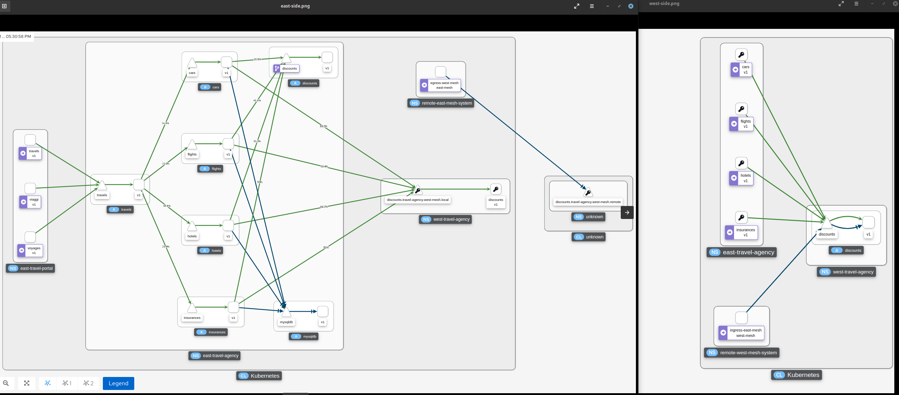

= Federation Demo Automation
:toc:

Service Mesh federation functionality and configurations are described in detail in the link:https://docs.openshift.com/container-platform/4.9/service_mesh/v2x/ossm-federation.html[documentation]. This is an automation for the demo link:https://github.com/kiali/demos/tree/master/federated-travels[Federated Travels with OpenShift Service Mesh] in order to test and compare quickly a setup.

ifdef::env-github[]
image:https://img.youtube.com/vi/USrTSixYd80/maxresdefault.jpg[link=https://youtu.be/USrTSixYd80]
endif::[]

.A walkthrough of the automation activities
ifndef::env-github[]
video::USrTSixYd80[youtube,list=PLZjCciga0z5w6PiJKl2P8UJKdG0cEXKcz]
endif::[]

== Pre-requisites 

1. 2 instances of either 
** local link:https://access.redhat.com/documentation/en-us/red_hat_codeready_containers/1.34/html/getting_started_guide[CodeReady Containers (CRC]) clusters or
** OpenShift Clusters (4.6+)
2. `oc` binary installed in the local path
3. `bash` capable command prompt
4. Prepare the Scripts and Operators

* Edit link:./0-setup-ocp-login-vars.sh[0-setup-ocp-login-vars.sh] to add URL and login token for the 2 clusters

	export OCP_1_LOGIN_TOKEN=<TOKEN CLUSTER 1>
	export OCP_1_LOGIN_SERVER=<API URL CLUSTER
	export OCP_2_LOGIN_TOKEN=<TOKEN CLUSTER 2>
	export OCP_2_LOGIN_SERVER=<API URL CLUSTER 2>

* Login to each cluster and apply the necessary operators subscriptions

	oc apply -f 0-operator-subscription.yaml

== Demo Example

== AWS - AWS Federation Setup
	
* Run the setup script which will
** Create the *control plane* namespaces in *West* and *East* cluster
** Create the `ServiceMeshControlPlane` resource in each cluster to create the OSSM Service Mesh instance
** Create the *data plane* namespaces and appropriate `ServiceMeshMemberRoll` to register them in the mesh
** Configure and setup peering between the *West* and *East* meshes 
*** sharing secrets to accept requests between meshes
*** setup `ServiceMeshPeer` and export/import the appropriate service
*** verify peering is setup
** Deploy the applications on both clusters
** Check federation is working

	0-execute-federation-setup-AWS-LB.sh
	
== AWS - GCP Federation Setup	

The script for this setup is perfrorming exactly the same activities as for the _AWS - AWS Setup_ 

	0-execute-federation-setup-AWS-GCP-LB.sh
